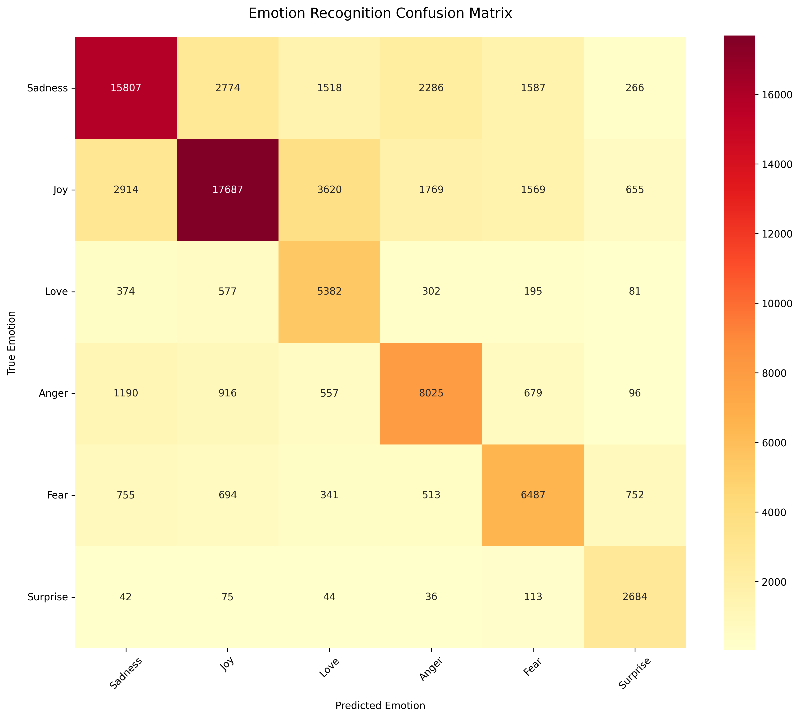

# Text Emotion Recognition with Reservoir Computing

This project implements a text-based emotion recognition system using Reservoir Computing and PyTorch. The system is capable of classifying text into six different emotions: sadness, joy, love, anger, fear, and surprise.

## Features

- GPU-accelerated Reservoir Computing implementation
- Multi-level emotion intensity analysis
- TF-IDF and custom emotion-based feature extraction
- Balanced class weights handling
- Early stopping and model checkpointing
- Real-time training progress visualization

## Emotions Detected

The system can detect the following emotions:
- Sadness
- Joy
- Love
- Anger
- Fear
- Surprise

## System Requirements

- Python 3.x
- CUDA-capable GPU (optional, but recommended)
- Required Python packages (install via pip):
  ```
  torch
  numpy
  pandas
  scikit-learn
  tqdm
  datasets
  ```

## Project Structure

```
├── data/                   # Data directory
├── models/                 # Saved model checkpoints
│   ├── best_readout.pt    # Best model checkpoint
│   └── emotion_classifier.pt # Final trained model
├── src/
│   ├── reservoir.py       # Reservoir Computing implementation
│   └── train.py          # Training and evaluation script
└── requirements.txt       # Python dependencies
```

## Installation

1. Clone the repository
2. Install dependencies:
   ```bash
   pip install -r requirements.txt
   ```

## Usage

To train the model:
```bash
python src/train.py
```

## Model Architecture

The system uses a Reservoir Computing approach with the following components:

- Input Layer: TF-IDF vectorization (1000 features) + emotion-specific features
- Reservoir Size: 400 neurons
- Spectral Radius: 0.95
- Sparsity: 0.1
- Leak Rate: 0.3
- Readout Layer: Linear layer with 6 outputs (one per emotion)

## Feature Engineering

The system employs sophisticated feature engineering:
1. TF-IDF features from text
2. Emotion intensity scoring based on hierarchical emotion dictionaries
3. Structural features (exclamation marks, question marks, capitalization)
4. Pattern-based emotion intensifiers

## Performance

The model achieves strong performance in emotion classification with:
- Overall accuracy: 67.26%
- Macro-average F1-score: 0.67
- GPU-accelerated training
- Batch processing
- Balanced class weights
- Early stopping to prevent overfitting

Detailed performance metrics:

```
Classification Report:
              precision    recall  f1-score   support

           0       0.75      0.65      0.70     24238  # Sadness
           1       0.78      0.63      0.69     28214  # Joy
           2       0.47      0.78      0.59      6911  # Love
           3       0.62      0.70      0.66     11463  # Anger
           4       0.61      0.68      0.64      9542  # Fear
           5       0.59      0.90      0.71      2994  # Surprise

    accuracy                           0.67     83362
   macro avg       0.64      0.72      0.67     83362
weighted avg       0.70      0.67      0.68     83362
```

Key observations:
- Strong performance on Sadness (F1: 0.70) and Joy (F1: 0.69)
- Excellent recall for Surprise (0.90)
- High precision for Joy (0.78) and Sadness (0.75)
- Balanced performance across major emotion categories

### Confusion Matrix Visualization



The confusion matrix visualization shows the model's prediction patterns across different emotion categories. The diagonal elements represent correct predictions, while off-diagonal elements show misclassifications. Darker colors indicate higher numbers of predictions.

## Dataset

The project uses the dair-ai/emotion dataset, which contains labeled emotional text data across six emotion categories. The dataset is automatically downloaded and preprocessed during training.

## License

This project is open-source and available under the MIT License.

## Contributing

Contributions are welcome! Please feel free to submit a Pull Request.